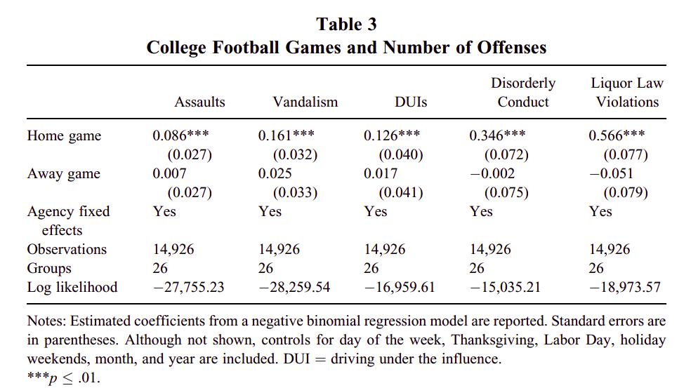
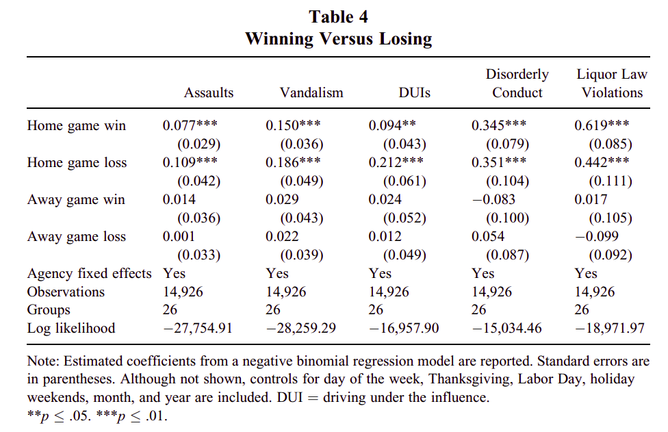

```{r setup, include=FALSE}
knitr::opts_chunk$set(
  message = FALSE,
  warning = FALSE,
  echo = FALSE
)
library(MASS) # for negative binomial model
library(tidyverse)
library(lubridate)
library(stringr)
library(knitr)

final_table <- read_csv("final_table.csv")
```

## Replicating Research Findings
### Table 2: Distribution of Game Days by Day of the Week
```{r replicate-table-2}
# Calculate number of games per day of the week
num_of_games_per_dotw <- final_table %>% 
    mutate(day_of_the_week = wday(day, label = TRUE)) %>%
    filter(game_status != "no_game") %>%
    group_by(day_of_the_week) %>%
    summarize(num_of_games = n_distinct(game_id))

# Calculate number of {DOTW} observered over the cfb season over 2000-2005 for all ORIs
num_of_observations_per_dotw <- final_table %>% # about 13 (num of {DOTW}) * 6 (years) * 26 (ORIs / num of agencies)
    mutate(day_of_the_week = wday(day, label = TRUE)) %>%
    group_by(day_of_the_week) %>%
    summarize(num_of_observations = n())
    
# Merge results
joined_tbl <- full_join(num_of_games_per_dotw, num_of_observations_per_dotw, by = "day_of_the_week")

# Add totals row
totals_row <- tibble(
  day_of_the_week = "Total",
  num_of_games = sum(joined_tbl$num_of_games),
  num_of_observations = sum(joined_tbl$num_of_observations))

tbl2 <- bind_rows(joined_tbl, totals_row) # Append totals

tbl2 %>% kable(col.names = c("Day of Week", "Games", "Observations"), 
                caption = "Table 2: Distribution of Game Days by Day of the Week") # display table
```

### Distribution of Offenses on Saturdays
```{r distribution-of-offenses-on-saturdays}
# Figure showing the mean number of offenses (assaults or vandalisms) on Saturdays 
# (with standard errors), broken out by whether a home game, away game, 
# or no game was played. 
final_table %>% 
    mutate(day_of_the_week = wday(day, label = TRUE)) %>%
    filter(day_of_the_week == "Sat") %>% 
    group_by(game_status) %>%
    summarize(avg_offenses = mean(assault + vandalism), 
              std_error = sd(assault + vandalism) / sqrt(n())) %>%
    ggplot(aes(x = game_status, y = avg_offenses)) +
    geom_errorbar(aes(ymin = avg_offenses - std_error, ymax = avg_offenses + std_error), width = 0.4) +
    geom_point(size = 5, color = "blue") +
    labs(x = "Game Status",
         y = "Average Number of Offenses", 
         title = "Mean Number of Offenses on Saturdays") + 
    scale_x_discrete(labels = c("no_game" = "No Game",
                                "home_game" = "Home Game",
                                "away_game" = "Away Game"))
```

### Distribution of Offenses on Saturdays By Team
```{r distribution-of-offenses-on-saturdays-per-team}
# Per-team plot: Show the same comparison separately for each college town / team instead 
# of aggregated across all teams.
final_table %>% 
    mutate(day_of_the_week = wday(day, label = TRUE)) %>%
    filter(day_of_the_week == "Sat") %>% 
    group_by(game_status, team_name) %>%
    summarize(avg_offenses = mean(assault + vandalism), 
              std_error = sd(assault + vandalism) / sqrt(n())) %>%
    ggplot(aes(x = game_status, y = avg_offenses)) +
    geom_errorbar(aes(ymin = avg_offenses - std_error, ymax = avg_offenses + std_error), width = 0.4) +
    geom_point(size = 3, color = "blue") +
    facet_wrap(~team_name) +
    labs(x = "Game Status",
         y = "Average Number of Offenses", 
         title = "Mean Number of Offenses on Saturdays Per Team") + 
    scale_x_discrete(labels = c("no_game" = "No Game",
                                "home_game" = "Home Game",
                                "away_game" = "Away Game"))
```

### Appendix: Descriptive Statistics for Count Variables
```{r replicate-appendix}
# function to get individual stats
quantile_generator <- function(table, type){
    select(table,type) %>%
    summarise(mean = mean(.data[[type]]),
        std = sd(.data[[type]]),
        Q1 = quantile(.data[[type]], 0.25),
        Q2 = quantile(.data[[type]], 0.50),
        Q3 = quantile(.data[[type]], 0.75),
        Q4 = quantile(.data[[type]], 0.90))
}

types = c("assault", "vandalism") # type of offences

# mapping out from our funciton to collect stats
all_day <- map_dfr(types,
                   quantile_generator,
                   table = final_table) # All Day stats

home_game <- map_dfr(types,
                     quantile_generator,
                     table = final_table %>% 
                     filter(game_status == "home_game")) # Home Game stats

away_game <- map_dfr(types,
                     quantile_generator,
                     table = final_table %>% 
                     filter(game_status == "away_game")) # Away Game stats

no_game <- map_dfr(types,
                   quantile_generator,
                   table = final_table %>% 
                   filter(game_status == "no_game")) # No Game stats

# binding all stats table into final appendix table
appendix <- bind_rows(all_day %>% mutate(day_type = "All Days",offense = types) ,
                      no_game %>% mutate(day_type = "No Game",offense = types),
                      home_game %>% mutate(day_type = "Home Game",offense = types) ,
                      away_game %>% mutate(day_type = "Away Game",offense = types))

# Formating table
appendix <- appendix %>% 
    pivot_longer(-c(day_type, offense),
                 names_to = "Stats", 
                 values_to = "Value") %>% 
                 pivot_wider(names_from = day_type, 
                             values_from = Value)
                            
appendix %>% kable(caption = "Appendix table: Descriptive Statistics for Count Variables")
```

### Table 3: College Football Games and Number of Offenses
```{r replicate-regression}
# Estimate a linear model of daily offense counts on home-game and away-game indicators, 
# controlling for agency fixed effects, day of week, month, and year. (Don't worry about the 
# fancier negative binomial model the authors fit.) Compare your findings to the paper's 
# (+9% assaults and +18% vandalism for home games, with no effect for away games).

# INC ---------------------------------------------------------------------------------------
regression_df <- final_table %>%
    mutate(day_of_the_week = factor(wday(day, label = TRUE), ordered = FALSE), # fixed effect : day of week
           month = factor(month(day), ordered = FALSE), # fixed effect : month of the year
           year = factor(year(day), ordered = FALSE), # fixed effect : year of the season
    ) %>% 
    mutate( home_game = case_when(game_status == "home_game" ~1, TRUE ~0), # Adding column for home_game, if there is home game that day then equals to 1 otherwise 0
            away_game = case_when(game_status == "away_game" ~1,TRUE  ~0), # Addin column for away_game, if there is away game that day then equals to 1 otherwise 0
    )
# Linear Models
## Linear regression model for predicting number of assault
assaults_model <- lm(assault ~ 
                    home_game + # effect of home_game
                    away_game + # effect of away_game
                    day_of_the_week + # fixed effect : day of week
                    month + # fixed effect : month 
                    year +  # fixed effect : year
                    factor(ori, ordered = FALSE), #fixed effect : Ori's/towns
                    data = regression_df 
                    )


## Linear regression model for predicting number of vandalism
vandalism_model <- lm(vandalism ~ 
                    home_game + # effect of home game
                    away_game + # effect of away game
                    day_of_the_week + # fixed effect: day of week
                    month + # fixed effect: month 
                    year +  # fixed effect: year
                    factor(ori,ordered = FALSE), # fixed effect: Ori's/towns
                    data = regression_df
                    )

# Function to extract coefficent from model summary and create a table
table_map <- function(models){
    data.frame(summary(models)$coefficients) %>%
    rownames_to_column(var = "factors") %>% 
    as_tibble()
}

assault <- table_map(assaults_model) %>% rename(P_value = Pr...t..) # regression coeff for prediciting assaults
vandalism <- table_map(vandalism_model) %>% rename(P_value = Pr...t..) # regression coeff for predicting vandalism

factors_to_print <- c("(Intercept)",
                    "home_game",
                    "away_game"
                    ) # for clean table only extraction coefficent for these factors
# Table showing coeff of regression models with std error and pvalue
bind_rows(assault %>% filter(factors %in% factors_to_print) %>% mutate(type = "Assault"),
        vandalism %>% filter(factors %in% factors_to_print) %>% mutate(type = "Vandalism")
        ) %>% kable(caption = "Table 3.1: Least square model")

# We did not get statistically significant result for effect of home_game or away_game in predicting assaults and vandalism
# Here we tried to use fancy Negative Binomial model to see if we get statistically significant result
# Negative Binomial Models
# #Negative binomial model for prediciting vandalism
vandalism_model_nb <- glm.nb(vandalism ~ 
                    home_game + # effect of home game
                    away_game + # effect of away game
                    day_of_the_week + # fixed effect: day of week
                    month + # fixed effect: month 
                    year +  # fixed effect: year
                    factor(ori,ordered = FALSE), # fixed effect: Ori's/towns
                    data = regression_df
                    )

## Negative binomial model for assault prediction
assaults_model_nb <- glm.nb(assault ~ 
                    home_game + # effect of home_game
                    away_game + # effect of away_game
                    day_of_the_week + # fixed effect : day of week
                    month + # fixed effect : month 
                    year +  # fixed effect : year
                    factor(ori, ordered = FALSE), #fixed effect : Ori's/towns
                    data = regression_df 
                    )

assault_nb <- table_map(assaults_model_nb) %>% rename(P_value = Pr...z..)# regression coeff for assault prediction
vandalism_nb <- table_map(vandalism_model_nb) %>% rename(P_value = Pr...z..)# regression coeff for vandalism prediction

# Table showing coeff of regression models with std error and pvalue
bind_rows(assault_nb %>% filter(factors %in% factors_to_print) %>% mutate(type = "Assault"),
        vandalism_nb %>% filter(factors %in% factors_to_print) %>% mutate(type = "Vandalism")
        ) %>% kable(caption = "Table 3.2: Negative binomial model")

```
### Analysis for Table 3


Comparing our Table 3.1 with original table from paper, both Estimate for homegame and awaygame fail to statistically explain number of 
assaults and vandalism. While on paper authors were able to show there was significant effect about 9% for assault and 18% for vandalism from home_game with p-value less than 0.01.
To further analyse this discrapancy, we tried to use the same Negative binomial model as described in paper whose result are in Table 3.2.
Here, we have much lower p-value compared to table 3.1 for homegame and also it shows e^0.1076^ which is +11.3% for assault and 
e^01209^ which is about +12.9% for vandalism. This doesnot exactly match the numbers in paper but does show the conclusion that homegames lead to increase in number of assaults and vandalism,
while away game doesnot have significant impact. Here we assume our alpha to be 0.06

### Table 4: Winning Versus Losing
```{r}
# Extracting cols to get factors for wins and losses
regression_df <- regression_df %>% 
    mutate( home_game_loss = case_when((home_game == 1 & home_win == 0) ~1, TRUE ~0), # Adding column for home_game_loss, 1 if home_game and home_loss otherwise 0
            away_game_loss = case_when((away_game == 1 & away_win == 0) ~1,TRUE  ~0), # Addin column for away_game_loss, 1 if away_game and away_loss otherwise 0
            home_game_win = case_when((home_game == 1 & home_win == 1) ~1, TRUE ~0), # Adding column for home_game_win, 1 if home_game and home_win otherwise 0
            away_game_win = case_when((away_game == 1 & away_win == 1) ~1,TRUE  ~0), # Adding column for away_game_win, 1 if away_game and away_win otherwise 0
    )

# Linear models
## Linear regression model for predicting number of assaults
assaults_model_with_win_loss <- lm(assault ~ 
                    home_game_win + # effect of home game win at home's ori
                    home_game_loss + #effect of home game loss at home's Ori
                    away_game_win + # effect of away game win at away's ori
                    away_game_loss + #effect of away game loss at away's ori
                    day_of_the_week + # fixed effect : day of week
                    month + # fixed effect : month 
                    year +  # fixed effect : year
                    factor(ori, ordered = FALSE), #fixed effect : Ori's/towns
                    data = regression_df 
                    )

## Linear regression model for predicting number of vandalism
vandalism_model_with_win_loss <- lm(vandalism ~ 
                    home_game_win + # effect of home game win at home's ori
                    home_game_loss + #effect of home game loss at home's Ori
                    away_game_win + # effect of away game win at away's ori
                    away_game_loss + #effect of away game loss at away's ori
                    day_of_the_week + # fixed effect: day of week
                    month + # fixed effect: month 
                    year +  # fixed effect: year
                    factor(ori,ordered = FALSE), # fixed effect: Ori's/towns
                    data = regression_df
                    )

assault_win_loss <- table_map(assaults_model_with_win_loss) %>% 
                    rename(P_value = Pr...t..) # regression coeff for prediciting assaults
vandalism_win_loss <- table_map(vandalism_model_with_win_loss) %>% 
                      rename(P_value = Pr...t..) # regression coeff for predicting vandalism

factors_to_print <- c("(Intercept)",
                    "home_game_win",
                    "away_game_win",
                    "home_game_loss",
                    "away_game_loss"
                    ) # table to only print follwing factors

# Final table with coeff and factors along with std error and pvalue                    
bind_rows(assault_win_loss %>% filter(factors %in% factors_to_print) %>% mutate(type = "Assault"),
        vandalism_win_loss %>% filter(factors %in% factors_to_print) %>% mutate(type = "Vandalism")
        ) %>% kable(caption = "Table 4.1: Least square model")

# Negative Binomial Model
## Negative binomial model for prediciting vandalism
vandalism_model_with_win_loss_nb <- glm.nb(vandalism ~ 
                    home_game_win + # effect of home game win at home's ori
                    home_game_loss + #effect of home game loss at home's Ori
                    away_game_win + # effect of away game win at away's ori
                    away_game_loss + #effect of away game loss at away's ori
                    day_of_the_week + # fixed effect: day of week
                    month + # fixed effect: month 
                    year +  # fixed effect: year
                    factor(ori,ordered = FALSE), # fixed effect: Ori's/towns
                    data = regression_df
                    )

## Negative binomial model for assault prediction
assaults_model_with_win_loss_nb <- glm.nb(assault ~ 
                    home_game_win + # effect of home game win at home's ori
                    home_game_loss + #effect of home game loss at home's Ori
                    away_game_win + # effect of away game win at away's ori
                    away_game_loss + #effect of away game loss at away's ori
                    day_of_the_week + # fixed effect : day of week
                    month + # fixed effect : month 
                    year +  # fixed effect : year
                    factor(ori, ordered = FALSE), #fixed effect : Ori's/towns
                    data = regression_df 
                    )

assault_win_loss_nb <- table_map(assaults_model_with_win_loss_nb) %>% 
                        rename(P_value = Pr...z..)# regression coeff for assault prediction
vandalism_win_loss_nb <- table_map(vandalism_model_with_win_loss_nb) %>% 
                        rename(P_value = Pr...z..)# regression coeff for vandalism prediction

# Table showing coeff of regression models with std error and pvalue
bind_rows(assault_win_loss_nb %>% filter(factors %in% factors_to_print) %>% mutate(type = "Assault"),
        vandalism_win_loss_nb %>% filter(factors %in% factors_to_print) %>% mutate(type = "Vandalism")
        ) %>% kable(caption = "Table 4.2: Negative binomial model")
```

### Analysis for Table 4


Comparing our Table 4.1 with original table from paper, all Estimate for home win/loss and away win/loss fail to statistically explain number of 
assaults and vandalism. While on paper authors were able to show there was significant impact of home game win and home game loss with p-value less than 0.01.
To further analyse this discrapancy, we tried to use the same Negative binomial model as described in paper whose result are in Table 4.2.
Here, we have much lower p-value compared to table 3.1 for homegame win and loss, but still we are not able to show paper's conclusion that home game win and home game loss have significant impact on assault and vandalism whereas
awaygame win and awaygame loss deosnot have statistically significant impact.